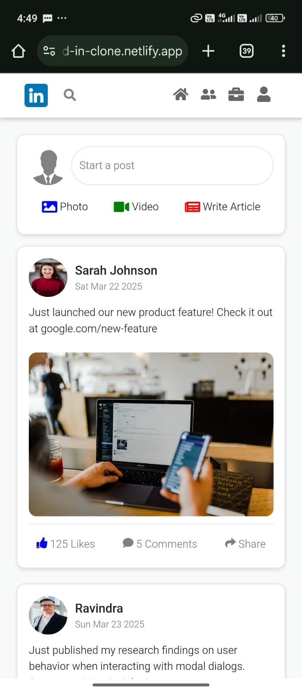

# LinkedIn Clone
## Project Overview
Welcome to LinkedIn Clone, a frontend-only professional networking application built using React, Bootstrap, JavaScript, CSS, Redux and LocalStorage.  
It is deployed at [kavana-navada-linked-in-clone.netlify.app](kavana-navada-linked-in-clone.netlify.app)

This project is designed to replicate LinkedIn’s core features, such as:  
- Viewing the posts.
- Adding comments.
- Like posts.
- Realtime update likes.
- Managing user profiles.  
- Exploring job listings.
- Saving jobs  
- Connecting with other users.  

Everything is handled on the frontend—there’s no backend, but we use LocalStorage to persist data like likes, saved jobs, and connections.  

---
## Project Goals  
Our goal is simple: **to build a LinkedIn-like UI that feels real, even without a backend!**  

✔️ **Create a sleek, professional UI** that mirrors LinkedIn.  
✔️ **Implement state management** using React & LocalStorage.  
✔️ **Ensure seamless navigation** with React Router.  
✔️ **Make it fully responsive** using Bootstrap.  
✔️ **Use JSON files** as a mock database for posts, jobs, and users. 

## Built With
We’re using a modern frontend tech stack to make this project scalable and user-friendly:  

| Technology        | Purpose |
|------------------|---------|
| **React.js**      | UI development with a component-based structure |
| **React Router**  | Enables seamless page navigation |
| **Redux** | State management for global data handling |
| **Bootstrap 5**   | Styling & responsive design |
| **HTML5 & CSS3**  | Basic structure and additional styling |
| **JavaScript (ES6+)** | Handles dynamic content & user interactions |
| **LocalStorage**  | Stores user interactions (likes, saved jobs, connections) |
| **JSON**         | Mock data source for posts, jobs, and users |
| **Netlify** | Deployment platform for hosting the app |

---
##  Key Features  
Here’s what you can expect from the app:  

### 🔑 **Login Page (Static UI Only)**  
- Simple **email & password fields** (no authentication but with validation).  
- Clicking login **redirects** to the Home Page.  

### 🏠 **Home Page (Post Feed)**  
- **Displays posts** dynamically from a `posts.json`.
- **Suggests People You Know** (Reused Component).
- Users can **like, comment, and share** posts.  
- Liked posts and comments stay **saved in LocalStorage**.  

### 👤 **User Profile**  
- Shows **profile picture, name, bio, and posts**.
- Suggests People You Know (Reused Component).
- Displays **Analytics** dynamically from a `jobs.json`
- Users can **edit their bio & job information** (saved in LocalStorage).  

### 💼 **Job Listings**  
- Jobs are fetched from `jobs.json`.  
- Users can **save jobs** to LocalStorage.  
- Clicking a View Details **opens a detailed job description**.  

### 🔗 **Connections**  
- Suggests **People You May Know**  dynamically from a `users.json`.  
- Clicking **Connect** adds them to the **My Connections** .  

### 📱 **Fully Responsive Design**  
- Works **perfectly** on **mobile, tablet, and desktop**.  
- Uses **Bootstrap Grid & CSS media queries**.  

---
## 📷 Screenshots  

### 🔑 Login   


### 🏠 Home 


### 👤 User Profile  
  

### 💼 Job Listings  
  

### 🔗 Connections 
  

### 📱 Mobile View 
<p >
  
    
    
</p> 

---
## How to build your own..?

Follow these steps to set up the project on your local machine.

### 📌 Prerequisites  
Before running the project, make sure you have the following installed:  
- **Node.js (LTS version recommended)** – [Download here](https://nodejs.org/)  
- **npm or yarn** (comes with Node.js)  
- **VS Code** – Recommended for development [Download here](https://code.visualstudio.com/)  

### 📥 Installation & Setup  

1. **Clone the repository**  
   ```sh
   git clone https://github.com/Kavana-navada/LinkedIn-Clone.git
   cd linkedin-clone

2. **Install dependencies**
   ```sh
   npm install
   ```
   or if using yarn:
   ```sh
   yarn install
   ```
3. **Run the development server**
   ``` sh
   npm run dev
   ```
   The app will start at http://localhost:5317/ (default Vite server).

## Project Structure
```linkedin-clone/
linkedin-clone/
│── dist/
│── node_modules/
│── public/                # Static assets
│   ├── _redirects
│   ├── linkedin.png
│   ├── linkedinL.png
│   ├── linkedinLogo.png
│   ├── notfound.png
│── src/                   # Main source code
│   ├── assets/            # Images, icons, and other assets
│   ├── components/        # Reusable UI components
│   │   ├── CreatePosts.jsx  
│   │   ├── Navigationbar.jsx  
│   │   ├── SuggestedConnections.jsx  
│   ├── data/              # Mock data in JSON format
│   │   ├── jobs.json  
│   │   ├── posts.json  
│   │   ├── users.json  
│   ├── pages/             # Page-level components
│   │   ├── Connections.jsx  
│   │   ├── Home.jsx  
│   │   ├── Jobs.jsx  
│   │   ├── LoginPage.jsx  
│   │   ├── NotFoundPage.jsx  
│   │   ├── Profile.jsx  
│   │   ├── SplashScreen.jsx  
│   ├── redux/             # Redux store & slices (State Management)
│   │   ├── searchSlice.js
│   │   ├── store.js
│   ├── styles/            # Modular CSS files for components
│   │   ├── Connections.module.css  
│   │   ├── CreatePost.module.css  
│   │   ├── Home.module.css  
│   │   ├── Jobs.module.css  
│   │   ├── LoginPage.module.css  
│   │   ├── Navbar.module.css  
│   │   ├── NotFoundPage.module.css  
│   │   ├── Profile.module.css  
│   ├── App.jsx            # Main application component  
│   ├── main.jsx           # Renders React app  
│── .gitignore             # Git ignore file  
│── eslint.config.js       # ESLint configuration  
│── index.html             # HTML template  
│── package.json           # Project dependencies  
│── package-lock.json      # Lock file for dependencies  
│── README.md              # Project documentation  
│── vite.config.js         # Vite configuration  
      
```
## 📖Usage Guide  

Now that you have the project set up, let’s walk through how to use the LinkedIn Clone.  

### 🏠 **Navigating the App**  
- **Login Page**: Enter any valid email and password (for UI purposes only).  
- **Home Page**: View and interact with posts.  
- **Jobs Page**: Explore job listings and save jobs.  
- **Profile Page**: View and edit your profile details.  
- **Connections Page**: Connect with suggested users.  

### 💡 **Interacting with Features**  
- Click **"Like"** on a post → Updates in real-time and saves to **LocalStorage**.  
- Add a **comment** on a post → Persists even after page reload.  
- Click **"Save Job"** → Job is stored in LocalStorage under **Saved Jobs**.  
- Click **"Connect"** on a user → They appear under **My Connections**.  

### 🛠 **Customization & Modifications**  
- Modify the `src/data/` JSON files (`posts.json`, `jobs.json`, `users.json`) to change default content.  
- Update the `styles/` folder to tweak the UI.  
- Want to add backend support? Use **Firebase** or **Node.js** to extend the project.  

### ❓ **Troubleshooting**  
- If the app doesn’t load properly, check the **console logs** in DevTools.  
- Run `npm install` again if you face dependency issues.  
- Restart the development server using `npm run dev`.
  
---
## 🌍 Deploying to Netlify  

Want to make your LinkedIn Clone live? Follow these steps to **deploy it on Netlify**:  

### **1. Build the Project**  
Run the following command to generate optimized production files:  
```sh
npm run build
```
This will create a dist/ folder with production-ready assets.

### **2. Deploy to Netlify**
  - Go to [Netlify](https://www.netlify.com/) and log in or sign up.
  - Click "New site from Git" ( or you can deploy manually by uploding dist folder).
  - Connect your GitHub repository.
  - Select the branch (usually main).
  - Set the build command as:
      ```sh
      npm run build
      ```
   - Set the publish directory as:
      ```ngnix
         dist
      ```
   - Click "Deploy Site".

### **3. Live Preview**
Once the deployment is complete, Netlify will provide a live URL for your project.
You can also set a custom domain in the Netlify settings.

Congratulations! Your LinkedIn Clone is now live on the internet.

---
## 🧪 Testing the Application
Since this is a frontend-only app, testing is manual.

### 🔹 What to test?
   - UI responsiveness (mobile, tablet, desktop).
   - LocalStorage functionality (likes, saved jobs, connections).
   - Navigation using React Router.
   - JSON data fetching (posts, jobs, profiles).

### 🔹 How to test manually?
   - Open Developer Tools (F12) in your browser.
   - Go to the Console & Network tab to check for errors.
   - Clear LocalStorage and reload to test data persistence.
   - Test all buttons, modals, and navigation.

### 🔹 Test Cases  

Here are some test cases to verify the core functionalities of the LinkedIn Clone.

###  1. Login Page  
| **Test Case** | **Expected Result** |
|--------------|------------------|
| Enter valid email and password & click "Login" | User is redirected to the Home Page |
| Enter invalid email format & click "Login" | Error message: "Enter a valid email" |
| Leave password blank & click "Login" | Error message: "Passwprd cannot be empty" |
| Click "Login" without entering anything | Stay on the same page with validation errors |

---

###  2. Home Page (Post Feed)  
| **Test Case** | **Expected Result** |
|--------------|------------------|
| Posts should load dynamically | Posts appear from `posts.json` |
| Click "Like" on a post | Like count increases & persists after reload |
| Click "Comment" & submit a comment | Comment should appear in the comment modal |
| Refresh the page after liking a post | The post remains liked (LocalStorage check) |
| Click "Connect" in "People you may know" | User moves to "My Connections" section |
---

###  3. User Profile Page  
| **Test Case** | **Expected Result** |
|--------------|------------------|
| Click on a profile icon | User is redirected to `/profile/:username` (hardcoded username as Ravindra, change the user name in url to display other profile)  |
| Update bio & job information | New info is saved & persists on reload |
| Scroll down to  activity section   | Displays user posts with like |
| Click "Connect" in "People you may know" | User moves to "My Connections" section |
---

###  4. Job Listings  
| **Test Case** | **Expected Result** |
|--------------|------------------|
| Jobs load from `jobs.json` | Jobs are displayed on the page |
| Click "Save Job" | Job gets stored in LocalStorage |
| Click "View Details" | A modal opens with full job details and save functionality|
| Search for a job title/ company | Results filter dynamically |
| Check "Show saved jobs only" | Results filter dynamically |

---

###  5. Connections & Networking  
| **Test Case** | **Expected Result** |
|--------------|------------------|
| "People You May Know" section loads users from `users.json` | Profiles appear dynamically |
| Click "Connect" on a user | User moves to "My Connections" section |
| Refresh the page after connecting | Connection persists (LocalStorage check) |

---
## 🛠 Debugging Issues  
If you run into problems, here are a few things to check:  

### 🔹 App not starting?  
```sh
npm install
npm run dev
```
  - Make sure Node.js and npm/yarn are installed.
  - Check if dependencies are installed with `npm list` or reinstall with `npm install`.
  - If using Vite, confirm it's running on the correct port (default: http://localhost:5173/).

### 🔹 Styles not loading?
  - Ensure Bootstrap is imported properly in `index.js` or `App.js`.
  - Check file paths of external stylesheets.

### 🔹 Page not found?
   - Make sure React Router is correctly handling navigation.
   - If using Netlify, create `_redirects` file with:
   ```bash
   /*  /index.html  200
   ```
---
## 🚀 Future Enhancements  

Here are some planned improvements for upcoming versions of the LinkedIn Clone:  
### 🔹 UI/UX Improvements  
- **Dark Mode Support**: Allow users to toggle between light and dark themes.

### 🔹 Better Search & Filtering  
- **Search Bar Enhancements**: Implement **autocomplete & suggestions** while searching.

### 🔹 Authentication System  
- Add a **secure login system** with **JWT authentication**.  
- Implement **Google OAuth** for easy sign-in.  

### 🔹 Notification Page
- Implementing notification page to get notified.


